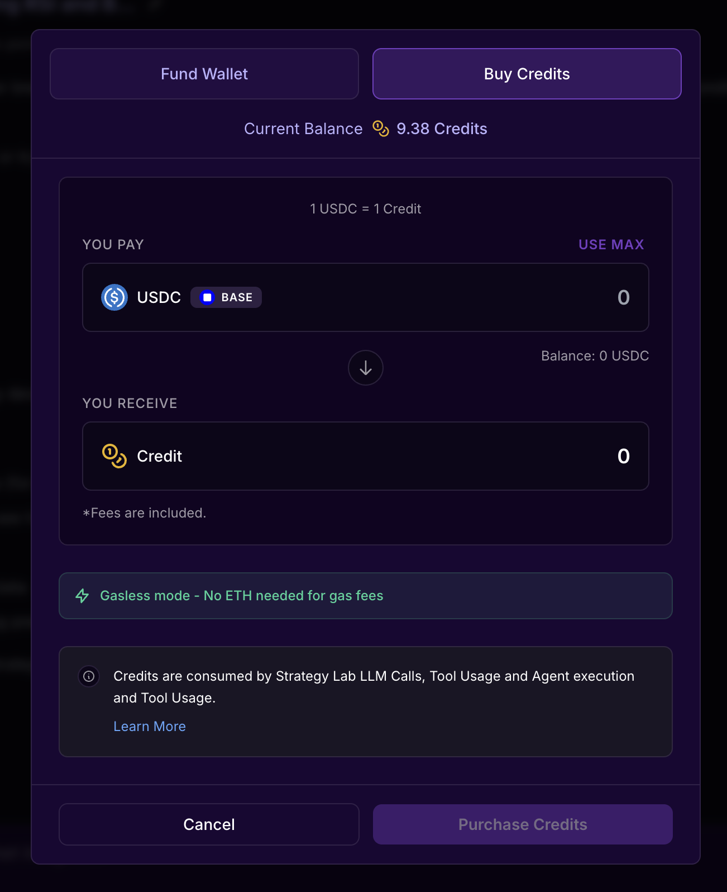

# Payment & Billing

This guide explains how Robonet's pricing and credit system works, how to purchase credits, and how to manage your account balance.

## Overview

Robonet uses a **credit-based billing system** where you pay for what you use. There are no subscription tiers or monthly fees - you simply purchase credits in USDC (stablecoin) and they're deducted as you use the platform's tools and features.

- Pay-as-you-go pricing (no subscriptions)
- Fixed or predictable cost per tool
- $25 welcome bonus for new users

## Pricing Structure

### Understanding Pricing Types

Robonet uses two pricing models:

- **<u>Fixed Pricing:</u>** Tools with a set cost per execution. You pay the same amount every time.
- **<u>Real Pricing (AI Tools):</u>** AI-powered tools charge based on actual LLM usage with a maximum cap. The actual cost depends on the complexity of your request and can range from $0.01 to the listed maximum. Most executions cost significantly less than the maximum.

---

### Tool Pricing Categories

Robonet tools are organized into pricing tiers based on computational and AI resource requirements:

#### Free/Low-Cost Data Access ($0.0001-0.10)
- **Get all strategies** - $0.001: List your strategies
- **Get strategy code** - $0.10: View strategy source code
- **Get strategy versions** - $0.01: View version history
- **Get latest backtest results** - $0.001: View past backtest results
- **Get all symbols** - $0.001: Get trading pair information
- **Get all technical indicators** - $0.001: List available indicators
- **Get Allora topics** - $0.0001: List available ML prediction topics
- **Get all prediction events** - $0.001: List prediction market events
- **Get prediction market data** - $0.001: Get market timeseries data
- **Get top leaderboard strategies** - $0.001: View top-performing strategies
- **Import strategy** - $0.001: Import existing strategy code

#### Standard Compute Tools ($0.001-0.01)
- **Run backtest** - $0.001: Test your strategy on historical data (fast, no AI)
- **Run prediction market backtest** - $0.001: Test prediction market strategies
- **Run Monte Carlo backtest** - $0.01: Advanced statistical backtesting

#### AI-Powered Tools (Real pricing, max $1.00-$4.50)
These tools charge based on actual LLM costs with the following maximums:
- **Generate ideas** - max $1.00: Get strategy suggestions based on market conditions
- **Enhance with Allora** - max $2.50: Integrate ML price predictions
- **Refine strategy** - max $3.00: AI-powered strategy refinement
- **Optimize strategy** - max $4.00: AI-powered parameter optimization
- **Create strategy** - max $4.50: Generate complete trading strategy from description
- **Create prediction market strategy** - max $4.50: Generate prediction market strategies

::: tip Real Pricing Explained
AI tools show a maximum price, but typically cost much less. For example, "create strategy" has a max of $4.50 but simple strategies might only cost $0.50-$1.50. You're only charged for the actual LLM tokens used, not the maximum.
:::

#### Deployment Tools ($0.05)
- **Create deployment** - $1.00: Create new deployment (EOA or Hyperliquid Vault)
- **List deployments** - Free: View your deployments
- **Start live trading** - Free: Activate a deployed strategy
- **Stop live trading** - Free: Stop a running strategy

::: tip Cost Control
Start with free data access tools (get all symbols, get all strategies) to explore. Use "generate ideas" (typically $0.20-0.50) to explore concepts before using "create strategy" (typically $0.50-2.00 but max $4.50). Test with "run backtest" ($0.001) before deploying.
:::

### Typical Workflow Costs

Here are estimated costs for common workflows (using typical AI costs, not maximums):

**Exploring Strategy Ideas** (~$0.40-1.20):
- Generate ideas: ~$0.20-0.50 (max $1.00)
- Create strategy: ~$0.80-2.00 (max $4.50)
- **Typical Total**: ~$1.00-2.50

**Testing a Strategy** (~$1.00-3.50):
- Create strategy: ~$0.80-2.00 (max $4.50)
- Run backtest: $0.001
- Optimize strategy: ~$0.60-1.50 (max $4.00)
- **Typical Total**: ~$1.40-3.50

**Enhanced Strategy with Allora** (~$2.50-6.00):
- Create strategy: ~$0.80-2.00 (max $4.50)
- Enhance with Allora: ~$0.50-1.20 (max $2.50)
- Run backtest: $0.001
- Optimize strategy: ~$0.60-1.50 (max $4.00)
- Run final backtest: $0.001
- Create deployment: $0.05
- **Typical Total**: ~$2.00-5.00

**Quick Strategy Iteration** (~$0.002):
- Get all symbols: $0.001
- Run backtest: $0.001
- **Total**: $0.002

### Other Costs

Hyperliquid vault creation incurs a $100 USDC fee. This fee is not refunded even if you close the vault. [Read more](https://hyperliquid.gitbook.io/hyperliquid-docs/hypercore/vaults/for-vault-leaders)

## Payment Methods

Robonet supports two ways to purchase credits through the following interface:



### 1. Credit Card Payment (Recommended)

Purchase credits directly with your credit or debit card using [Privy](https://privy.io)'s secure payment infrastructure. No cryptocurrency wallet required.

**How it works:**
1. Click "Buy Credits" in the web interface
2. Enter the amount in USD (minimum $1.00)
3. Enter your card details in the secure Privy payment form
4. Complete the payment
5. Credits appear instantly in your account

**Supported Cards:**
- Visa, Mastercard, American Express
- Debit and credit cards
- No cryptocurrency knowledge required
- Instant credit delivery

::: tip Easy Onboarding
Credit card payments are the fastest way to get started. No need to acquire USDC or manage crypto wallets - just pay with your card and start building strategies immediately.
:::

### 2. Direct On-Chain USDC Deposit

You can deposit USDC directly from any crypto wallet to your Robonet deposit address.

**How it works:**
1. Navigate to "Deposit" in your account settings
2. Copy your unique deposit address
3. Send USDC (Base network) from any wallet
4. Credits are automatically added after 12 block confirmations (~2-3 minutes)

**Network Details:**
- **Chain**: Base mainnet (Chain ID: 8453)
- **Token**: USDC (`0x833589fCD6eDb6E08f4c7C32D4f71b54bdA02913`)
- **Minimum**: $1.00 USDC
- **Confirmations required**: 12 blocks

::: warning Network Selection
Make sure you're sending USDC on the **Base network**, not Ethereum mainnet or other chains. Sending to the wrong network will result in lost funds.
:::

## Account Balance & Limits

### Checking Your Balance

You can view your current balance at any time:

**In the web interface:**
- Open the right sidebar by clicking the top-right button containing your wallet address
- Balance is displayed beneath your username

**Via API:**
```bash
GET /api/v1/credits/balance
```

**Balance Details:**
- **Available balance**: Credits you can spend right now
- **Reserved credits**: Credits held during active tool execution
- **Total deposited**: Lifetime deposits (excluding welcome bonus)
- **Total spent**: Lifetime spending across all tools
- **Total withdrawn**: Lifetime withdrawals back to your wallet

### Welcome Bonus

All new users receive a **$25 welcome bonus** to explore the platform.

**Important notes:**
- One-time bonus per account
- Cannot be withdrawn (only used for tools)
- Tracked separately from deposited credits
- Spent before deposited credits

### Rate Limits

To ensure fair usage, Robonet enforces these limits:

**API Rate Limit:**
- 100 requests per 60 seconds per IP address
- Applies to all endpoints except chat streams
- Returns HTTP 429 if exceeded

**Credit Limits:**
- Minimum purchase: $1.00 USDC
- No maximum limits

**Account Blocking:**
If your balance goes negative (rare edge case), your account is automatically blocked until the balance is resolved.

## Frequently Asked Questions

### Do I need a subscription?

No. Robonet has no subscription tiers or monthly fees. You simply purchase credits and use them as needed.

### What happens if I run out of credits?

Tools will fail to execute if you don't have sufficient credits. You'll receive an error message prompting you to purchase more credits. Your balance is checked before each tool execution.

### Can I get a refund?

If a tool execution fails, credits are automatically refunded to your account. You can also withdraw your deposited credits at any time (if withdrawals are enabled).

### How are AI tool costs calculated?

AI-powered tools use **real pricing** based on actual LLM token usage. The system reserves the maximum possible cost upfront (e.g., $4.50 for "create strategy"), but only charges the actual cost after execution. Simple requests might cost $0.50-1.00, while complex multi-step strategies might cost $2.00-4.00. You're never charged more than the stated maximum.

Non-AI tools have **fixed pricing** ($0.0001-0.10 per execution) and always cost the same amount.

### Is there a discount for high-volume usage?

Currently, pricing is the same for all users. Enterprise or high-volume users can contact support for custom pricing arrangements.

### What payment methods are supported?

Robonet accepts payments via:
1. **Credit/debit card** via [Privy](https://privy.io) (recommended) - instant, no crypto required
2. **Direct USDC deposit** to your deposit address on Base network

### Do I need cryptocurrency to use Robonet?

No. You can purchase credits with a regular credit or debit card via [Privy](https://privy.io). No cryptocurrency wallet or knowledge is required. However, if you prefer, you can also deposit USDC directly on the Base network.

### What blockchain network do you use?

Robonet's payment system operates on **Base** (Ethereum L2 network, Chain ID: 8453) using USDC as the payment token.  Agents and vaults may exist on other chains, which will be stated in the UI.

### How long do deposits take?

- **Credit card payments**: Instant (usually <30 seconds)
- **On-chain USDC deposits**: 2-3 minutes (after 12 block confirmations)

### What happens to my credits if I stop using Robonet?

Your credits remain valid indefinitely. You can withdraw them back to your wallet at any time (if withdrawals are enabled).

### Are there any hidden fees?

No hidden fees. All tool costs are displayed upfront, and there are no withdrawal fees (unless configured by the platform). Credit card payments are processed securely through Privy with transparent pricing.

### How do I track my spending?

View your complete transaction history in Account Settings → Billing. Every credit transaction is logged with full details: amount, tool name, timestamp, and balance changes.

### Can I share credits with another account?

No. Credits are non-transferable between accounts. Each account must purchase and manage its own credits.

### What if a tool takes too long and I want to cancel?

Credit reservations expire after 10 minutes if the tool doesn't complete. The credits will be automatically released back to your balance. You cannot manually cancel an in-progress tool execution.

### Is my payment information secure?

Yes. Robonet uses [Privy](https://privy.io) for secure authentication and payment processing. We never handle or store your credit card information or private keys. Credit card payments are processed through Privy's PCI-compliant infrastructure, and USDC payments are on-chain and transparent.

### How can I optimize my costs?

**Cost-saving tips:**
- Use low-cost data access tools ($0.001) to explore before AI tools
- Start with "generate ideas" (~$0.20-0.50) before "create strategy" (~$0.80-2.00)
- Keep AI prompts clear and concise to minimize LLM token usage
- Use "run backtest" ($0.001) multiple times before optimization
- Review backtest results carefully before running optimization (~$0.60-1.50)
- Test strategies on shorter time periods first (same cost, faster results)
- Use the welcome bonus ($25) to experiment with different workflows

---

## Need Help?

If you have questions about billing or need assistance:

- **Documentation**: Check other guides in this documentation
- **Support**: Contact support through the web interface
- **Transaction Issues**: Check your transaction history and on-chain confirmations

::: tip Getting Started
New users receive a $25 welcome bonus. This is enough to:
- Generate 25-125 strategy ideas (depending on complexity)
- Create 5-30 strategies (depending on complexity)
- Run 25,000 backtests
- Optimize 6-40 strategies (depending on complexity)
- Run 250,000 data access queries

Remember: AI tools show maximum prices but typically cost 20-50% of the maximum. Your $25 will go further than you think!
:::
